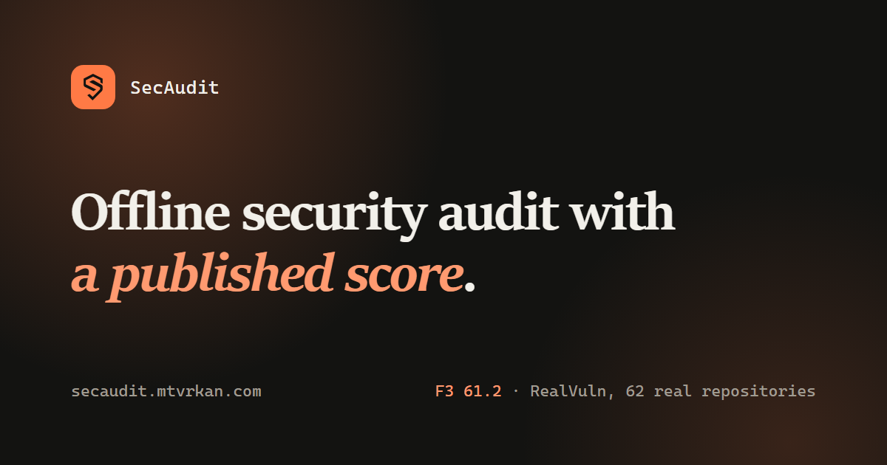

<div align="center">



# SecAudit

**A security scanner that publishes its own detection rate — and lets you re-run the
measurement yourself.**

[](https://github.com/mtvrkan/secaudit/actions/workflows/validate.yml)
[](LICENSE)
[](https://docs.claude.com/en/docs/claude-code/plugins)
[](https://owasp.org/www-project-top-ten/)

[Türkçe](README.tr.md) · [secaudit.mtvrkan.com](https://secaudit.mtvrkan.com)

</div>

---

## What it actually does

You point it at a **codebase**, a **running site**, or both. It reads them, decides what is
wrong, and writes a report you can act on or hand to an assessor.

**Given a repository**, it reads the source and reports:

- **Injection reachable from a request** — a taint engine follows untrusted input across lines,
  functions and files, so `db.query(sql)` is reported when `sql` was built from `req.query.name`
  and *not* when the value was bound as a parameter. Every finding ships the path:
  `L12: req.query.name (request) → L13: TAINT-JS-SQLI argument 0`.
- **Dependency advisories with a verdict, not a dump** — each CVE is classified by whether your
  code can actually reach the vulnerable import, into an
  [OpenVEX](https://github.com/openvex/spec) status with the evidence for the call.
- **Secrets** in code and in git history, masked in the report.
- **Configuration and infrastructure** — Dockerfile, Terraform, CloudFormation, Kubernetes,
  Compose, cloud IAM, GitHub Actions.
- **Structural flaws a pattern cannot see** — a login endpoint with no rate limit, an upload
  written without a check between read and write, a request body spread into a persisted object
  with no allowlist, a handler that looks a row up by a caller-supplied id and never constrains
  it by the caller.

**Given a URL**, it checks headers, TLS, cookies, exposed paths and the technology it can
fingerprint, then runs OWASP web and API tests. Passive checks need no permission; anything that
changes state is refused until you assert you own the target.

**What you get back**: findings ranked by severity, each with the evidence, the root cause, a
specific fix and a step to retest it — plus a dependency register, the controls you already have
right, and a 24–72h / 7–14d / 30–60d remediation order. English or Turkish. `--format` also
emits SARIF for GitHub code scanning, a CycloneDX SBOM, an OpenVEX document, or an EU Cyber
Resilience Act evidence pack.

**How it runs**: one Python package with **zero dependencies**, no API key, no account and no
network. It is deterministic — the same code in gives the same findings out, and CI proves it by
scanning one fixture in four processes under different hash seeds and failing if the results
differ. An optional LLM tier adds triage and logic-bug discovery when you bring your own key; it
is off by default and **no number here describes it**.

> **Defensive use only.** SecAudit is for auditing systems **you own or are explicitly authorized
> to test**. Active testing requires you to assert authorization. It will never produce weaponized
> exploits, malware, DoS payloads, or unauthorized-access tooling. See
> [Ethics & Legal](#ethics--legal).

## Install and run

```bash
# In Claude Code — the plugin, with the live-target track and the authorization gate:
/plugin marketplace add mtvrkan/secaudit && /plugin install secaudit@secaudit-kit
/secaudit .

# Or without Claude Code at all — the same engine, no LLM, no network, no dependencies:
pip install secaudit-kit && secaudit .
```

## Why it is worth a look

Most security scanners publish no number, need a key, and stop at the edge of your checkout.
SecAudit's deterministic tier runs anywhere, scores itself on someone else's benchmark, and is
wrapped in the parts an audit actually needs: a live target, a consent boundary, and a document
you can hand to an assessor.

- **Three published, reproducible numbers, on corpora this project does not own** — F3 **61.2**
  on [RealVuln](https://github.com/kolega-ai/Real-Vuln-Benchmark) (Python) and recall **0.5445**
  on [SecBench.js](https://github.com/cristianstaicu/SecBench.js) (JavaScript), both scored by
  their own scorers, raw output committed, CI red if the prose stops matching it. The JavaScript
  figure was **0.2286 blind**, before this project had read a single one of its labels; that is
  the number to use when the question is how the engine does on code it has never seen.
  Caveats first, and they are the point.
- **And the blind one — the worst number here and the most honest.** On
  [CVEfixes](https://doi.org/10.5281/zenodo.13118970), 3,576 real CVEs joined to the commits that
  fixed them, SecAudit finds **24.5%** of the CVEs and **15.7%** of the vulnerable files. A fifth
  of that corpus was sealed *before the first scan* and is never inspected — and the sealed slice
  scores **17.06%** against **15.32%** unsealed. **That is what "nothing was tuned to this corpus"
  looks like when it is measured instead of asserted:** if the rules had been fitted to the labels
  we read, the relation would run the other way. The gap to 61.2 is why it is published — RealVuln
  is 62 **applications**, where taint starts at a request; CVEfixes is mostly **libraries**, and a
  library has no request. [`eval/cvefixes/`](eval/cvefixes/).
- **And one for the question none of the others answer** — *how much of your time will this
  waste?* **0.42 findings per 1,000 lines** across fifteen maintained projects that are not a
  vulnerability corpus, **0.09** of them High or Critical. A 100k-line codebase gets about 42
  findings, 9 of them actionable. Published as a **noise floor, not a precision**: nobody
  adjudicated those findings and some may be real. [`eval/noisefloor/`](eval/noisefloor/).
- **EU Cyber Resilience Act evidence, from the same scan** — `--format cra` emits a CycloneDX 1.6
  SBOM, a vulnerability register with VEX status and reachability, and each finding mapped to the
  clause it bears on (Annex I Part I (2)(a), Part II (1)/(2)/(3)). Vulnerability-handling
  obligations apply from **2026-09-11**. Findings also carry an **OWASP ASVS 5.0** chapter. It is
  input to a compliance process, not a certificate, and the pack says so in its own disclaimer.
- **Coverage most scanners stop short of** — OWASP Web, API, LLM and Mobile Top 10 and the CWE
  Top 25, plus the 2025–2026 additions: agentic-AI and MCP risks (tool poisoning, excessive
  agency), auth and identity (JWT/OAuth/OIDC/SAML), HTTP request smuggling, cache poisoning, and
  current supply-chain attacks (self-replicating install-script worms, mutable-tag CI compromise,
  slopsquatting, provenance/SLSA).
- **It uses your tools when you have them** — `semgrep`/`opengrep`, `trivy`, `osv-scanner`,
  `gitleaks`, `trufflehog`, `zizmor`, `testssl.sh`, and authorized-only `nuclei`/ZAP for active
  scans. **None of them is required to start**, and none of the published numbers uses one.
- **The authorization boundary is code, not a prompt** — active testing is gated by a
  deterministic PreToolUse hook that refuses offensive scanners and state-changing requests until
  you assert ownership. No DoS, no brute force, no data exfiltration, ever.

## How this differs from Claude Code's built-in security tools

Anthropic ships two official security plugins and they are good. **Install them.**
[`security-guidance`](https://code.claude.com/docs/en/security-guidance) reviews code as Claude
writes it; the [Claude Security plugin](https://code.claude.com/docs/en/claude-security) runs a
multi-agent scan of a repository and produces reviewed patches. Both read the source in your
checkout.

SecAudit is not trying to be better at that, and the LLM tier here is not an attempt to
out-agent an agent that ships free inside the product. It covers what those deliberately leave
out:

| | Official plugins | SecAudit |
|---|---|---|
| Reviews code as Claude writes it | ✅ | — |
| Multi-agent repo scan → reviewed patches | ✅ | — |
| **Audit a running site or API** | — | ✅ |
| **Authorization gate + `scope.yaml` for active testing** | — | ✅ |
| **Runs without Claude Code, without a paid plan, offline** | — | ✅ |
| **Published, reproducible detection score** | — | ✅ |
| **Same code in, same findings out — held by a gate, not by an adjective** | — | ✅ |
| **SBOM, OpenVEX and EU CRA evidence pack** | — | ✅ |
| **Same engine from Codex, Cursor, OpenCode (MCP server)** | — | ✅ |

The official docs are explicit that their review *"reads the source code in your checkout, not
a running site or deployed service"*, and that scans are nondeterministic — *"two scans of the
same code can surface different findings"*. Neither plugin models an authorization boundary for
testing a target you must prove you own, and neither produces an artefact for an auditor.

Determinism is the row that has to earn itself, because it is a claim about something you cannot
see happening. Here it is a gate: CI scans one fixture in four separate processes under different
`PYTHONHASHSEED` values and fails if the finding sets differ. That gate exists because the
property broke — taint attribution walked a hash-ordered set, so the same engine reported the
same bug on line 739 or line 743 depending on the run, and one benchmark label drifted in and out
of scoring range with it. It was caught by a published number moving while the code stood still,
which is the failure mode the engine-digest seal is structurally blind to. The fix and the test
landed together; the story is in [`CHANGELOG.md`](CHANGELOG.md).

Run them together: the in-session plugin reduces what reaches your branch, and SecAudit answers
the question you get asked afterwards.

## Install

**Requires [Claude Code](https://docs.claude.com/en/docs/claude-code).** In a Claude Code session:

```
/plugin marketplace add mtvrkan/secaudit
/plugin install secaudit@secaudit-kit
```

That's it. No tools to install to get started — SecAudit works with just Claude. For deeper
scans, optionally install the [recommended tools](docs/tooling-setup.md) (`semgrep`,
`osv-scanner`, `gitleaks`, `testssl.sh`).

<details>
<summary>Manual install (without the marketplace)</summary>

```bash
git clone https://github.com/mtvrkan/secaudit
cp -r secaudit/plugins/secaudit/skills/*   ~/.claude/skills/
cp -r secaudit/plugins/secaudit/commands/* ~/.claude/commands/
cp -r secaudit/plugins/secaudit/agents/*   ~/.claude/agents/
```

> Manual install copies the skill, commands, and agent — but **not** the PreToolUse
> `hooks/`, which the marketplace install wires automatically. Without the hook, the
> passive/active authorization gate falls back to model discipline only (the deterministic,
> harness-level block on active scanners and probe payloads is not active). To keep it, also
> register `plugins/secaudit/hooks/active-scan-guard.py` as a PreToolUse hook — see
> [`hooks/README.md`](plugins/secaudit/hooks/README.md).
</details>

## Usage

```bash
/secaudit https://your-site.com        # full audit of a live target (passive by default)
/secaudit ./path/to/your/repo          # static source-code + dependency + secret audit
/secaudit https://site.com ./repo      # both — code confirms live findings and vice-versa

/secaudit-code                         # source-only audit of the current directory
/secaudit-passive https://site.com     # recon only, zero authorization needed
/secaudit-deps                         # dependency + supply-chain + secret scan only

/secaudit https://site.com --active    # authorized active testing (you assert ownership)
/secaudit ./repo --lang tr             # report in Turkish
```

For active testing against a live target, fill in
[`templates/scope.example.yaml`](templates/scope.example.yaml) or assert authorization in
chat. See [Authorization](docs/authorization.md).

## Run it without Claude Code (standalone kit)

The [`kit/`](kit) directory is a dependency-free Python CLI that runs **outside** a Claude Code
session — in CI, cron, or a plain shell — and is **not tied to Claude**:

```bash
python -m secaudit_core.cli /path/to/repo --min high        # Tier 0: deterministic, no LLM, no key
python -m secaudit_core.cli /path/to/repo --format cra      # EU CRA evidence pack (SBOM + register + VEX)
python -m secaudit_core.cli /path/to/repo --format cyclonedx # CycloneDX 1.6 SBOM only
python -m secaudit_core.cli /path/to/repo --format html     # self-contained report; print to PDF
python -m secaudit_core.cli /path/to/repo --backend ollama  # optional local-model enrichment
ANTHROPIC_API_KEY=… python -m secaudit_core.cli /path/to/repo --backend anthropic   # or Claude/OpenAI
```

**Tier 0** (built-in detector pack + taint analysis + `npm audit`) always runs, needs no key and
is reproducible — it is the tier every number here describes. **Tier 1** is opt-in LLM triage
and logic-bug discovery behind a pluggable backend (`anthropic` / `openai` / `ollama` / `none`);
it is unmeasured, it sends source code, and it is
[described in full below](#the-llm-tier-optional-unmeasured-and-staying-that-way) before you
turn it on.

What the LLM-free tier actually measures
on the shipped corpora is in the generated [scorecard](eval/scorecard.md) — reproduced below,
and regenerated by CI rather than restated here.

### Measured, by a harness you can run

| Metric | Tier 0, no LLM, no external scanners |
|---|---|
| Recall | **98%** (61/62 labelled vulnerabilities, 15 languages) |
| Precision | **100%** (upper bound — see the scoring rules) |
| F1 · F3 | **0.992** · **0.986** |
| False positives on safe-implementation traps | **0** / 62 |

```bash
python3 eval/harness.py        # reproduce it
```

The one miss is IDOR / broken access control, which has no reliable static signature and is
documented as belonging to the LLM tier. Labels are **generated** from the fixtures, floors
live in [`eval/thresholds.json`](eval/thresholds.json), and CI fails if the committed
[scorecard](eval/scorecard.md) stops matching what the engine measures.

**This is a regression floor, not a forecast.** These fixtures were written alongside the
detectors, so the number says "this still works", not "this will work on your code".

### The external number: F3 61.2 on Python, recall 22.9% on JavaScript

Measured on the [RealVuln benchmark](https://github.com/kolega-ai/Real-Vuln-Benchmark) — 66 real
vulnerable repositories labelled by people who have never seen this code, scored by their scorer,
not ours.

| | F3 | Precision | Recall |
|---|---|---|---|
| Purpose-built (Kolega.Dev) | 73.0 | 0.388 | 0.809 |
| General-purpose LLM (Claude Sonnet 4.6) | 51.7 | 0.785 | 0.498 |
| Rule-based SAST (Semgrep) | 17.7 | 0.205 | 0.175 |
| **SecAudit Tier 0** | **61.2** | **0.6560** | **0.6073** |

**Read the caveat before the number.** The first two runs scored 12.5 and 13.3 and were blind —
the engine had never seen this corpus. 24.6, 26.0, 30.9, 31.5, 35.8, 35.9, 39.3, 39.2, 41.6, 59.5, 59.7, 60.6, 60.5 and 61.2 are not: the rules added since
were chosen by reading this benchmark's own false negatives. Every one of them is a rule any SAST
ships (weak PRNG for tokens, cookie flags, CSRF exemptions, a committed fallback signing key,
debug-on-by-default, open redirect, NoSQL injection, credentials in logs, catastrophic
backtracking), so none is a pattern fitted to a fixture — but the *selection* was informed by
the corpus, which is the same disclosure `eval/scorecard.md` has always carried about the
fixture set. 12.5 is what this engine did on a corpus it had not read; 61.2 is what it does on
one it has read repeatedly, and the gap between those two numbers is the size of the advantage.

**Precision is the constraint, not a by-product.** It rose with recall for seven consecutive
rounds and fell in the eighth; the round that fell was kept, with the reason written out rather
than smoothed over. A round that has to spend precision to buy recall is recorded as such, and
two widenings have been **measured and rejected** for costing more than they bought. Every round
— what moved, what it cost, and the two occasions a published figure turned out to describe an
engine that no longer existed — is in [`eval/realvuln/`](eval/realvuln) and `CHANGELOG.md`.

What still does not move: `broken_access_control` (2/76) and `missing_auth` (7/74) — 141 of the
150 labels across those two families, which is a fifth of every miss on this corpus, in the one
class an application owner asks about first. `path_traversal` was on this list at 3/39 and is
now 23/39, which is what a family looks like when the diagnosis was a missing shape rather than
a missing capability. Reading the misses in the two largest remaining pools —
`sensitive_data_exposure` and `security_misconfiguration` — shows why: most of those labels sit
on a handler definition, so the flaw is a property of everything the handler returns rather than
of anything inside it. That needs the business-logic pass, not another rule, and the full
accounting is in [`eval/realvuln/`](eval/realvuln).

### The other language

RealVuln is Python-only. The JavaScript and TypeScript side — 31 pattern rules, five structural
analyses and a taint tier — is measured separately against
[SecBench.js](https://github.com/cristianstaicu/SecBench.js): **recall 0.5445, 312 of 573 labelled
sinks across 575 real npm packages**. That is nineteen packages fewer than the previous run could
fetch — they have been removed from npm since, their labels count as misses, and the two figures
are therefore not the same measurement. The comparable half is the engine's own: misses caused by
*no rule fired at the sink* went 213 → 201.

**The first run of that benchmark was blind — recall 0.2286 — and this one is not.** The blind
figure was measured before this project had read a single SecBench.js label; it is the honest
answer to *how does this engine do on code it has never seen*, and it does not improve. What the
blind run bought was a diagnosis, and the number below is what the engine scores after acting on
it.

| Class | Found / labelled | Recall | Blind run |
|---|---|---|---|
| `code-injection` | 22 / 33 | **66.7%** | 19 / 33 |
| `command-injection` | 62 / 101 | **61.4%** | 41 / 101 |
| `path-traversal` | 128 / 167 | **76.6%** | 61 / 167 |
| `prototype-pollution` | 72 / 185 | **38.9%** | 10 / 185 |
| `redos` | 28 / 87 | **32.2%** | 0 / 87 |

**Every class that moved there moved for one reason: the engine could not see the construct it
was looking at** — a default parameter value that made a function one line long to the analysis
scoping every structural rule, `exec` being whatever the file happened to import, a ReDoS
criterion that described exponential backtracking when most published advisories are quadratic.
None of it was a threshold; each was a shape, which is why the held-out slice moved with the
rest. The label-by-label accounting is in [`eval/secbenchjs/`](eval/secbenchjs).

**A fifth of that corpus is sealed** ([`eval/HELDOUT.md`](eval/HELDOUT.md)) — scored every round,
never inspected, so a round that only fits the labels it read shows up as unsealed moving while
sealed does not. Two rounds have now asked it, and both times the improvement generalised — by
sealed **0.4215 → 0.4545 → 0.5455 → 0.5868**, unsealed **0.3739 → 0.4027 → 0.4735 → 0.5288** —
the half nobody read moved further in two of the four.

**Precision is deliberately not published for that corpus.** SecBench.js labels one vulnerability
per package and says nothing about the rest of it, so an unmatched-finding ratio is a lower bound
on noise rather than a precision, and quoting it beside 0.704 would compare two measurements that
share a name. Full accounting in [`eval/secbenchjs/`](eval/secbenchjs).

Full result — per-family, per-repo, all thirty runs, what could not be cloned and why —
[`eval/realvuln/`](eval/realvuln). The raw scorer output is committed and CI fails if these
figures stop matching it. Two numbers, both true: 0.986 is what the engine still does on the
corpus it was built against, 61.2 is what it does on 62 real repositories.

### The LLM tier: optional, unmeasured, and staying that way

**Every figure on this page is Tier 0.** The LLM tier is off by default, needs a key you supply,
and has **no measured number** — not "not yet", but as a standing decision. Measuring it means
paid inference across 62 repositories, and this project does not carry that cost. The harness
ships anyway ([`eval/realvuln/`](eval/realvuln), one command) so anyone who wants the number can
produce it; if you do, open an issue and it goes on this page with your name on it.

That is a deliberate narrowing of the claim, so read the claim narrowly. On this same benchmark
a general-purpose model scores **51.7** with no harness at all — the deterministic tier is now
above that, at 61.2, but the model was measured blind and this engine has read the corpus four
times, so the comparison is not the win it looks like. The honest pitch is not "we find more".
It is: **we find reproducibly, offline, with
a consent boundary and an artefact an assessor can read — and we publish the number.** Nobody
should install this expecting the LLM tier to be the reason.

What the tier does when you switch it on: triage and adversarial refutation of Tier-0 findings,
and a business-logic pass over a per-handler fact map aimed at the classes above that do not
move (`broken_access_control`, `missing_auth`). It emits no Tier-0 finding, so switching it on
cannot change any figure here — and switching it off is the default the numbers describe.

**One piece of history stays, because the claim was public for a month.** Until 2026-08-13 the
tier's prompt carried only Tier-0's own findings and no source at all, so triage was judging a
citation rather than code. Fixed in [`llmcontext.py`](kit/secaudit_core/llmcontext.py) — which
moved the tier from *cannot* to *untested*, a smaller claim than it sounds.

> **Switching it on sends your source code.** Excerpts around every Tier-0 finding *and* whole
> files Tier 0 never flagged — that second part is the only way a model reaches the classes the
> pattern tier structurally cannot. So `--backend ollama` (local, nothing leaves the machine) is
> a privacy decision, not a cost one. Credential-shaped files (`.env`, `*.pem`, `*.key`,
> `secrets/`, …) are withheld from every backend. Four model calls per scan, and when a
> repository does not fit, the report says how many files were not sent — a triage over a
> partial view is never printed as a clean bill.

## What you get

A structured report: executive summary → scope & constraints → methodology → severity-ranked
findings (each with impact, evidence, root cause, **specific fix**, and a **retest step**) →
dependency/CVE register → positive controls you already have → a prioritized remediation
roadmap. See a [sanitized example report](examples/example-report.md).

> **Tested on itself — recall *and* precision.** Two paired fixtures. The **vulnerable** one
> plants **62 code flaws** across **15 languages** plus 10 dependency vulns and secrets; the
> committed [self-test report](examples/self-test-report.md) is a captured fallback-mode run
> (no scanners installed) that surfaces them all — **recall**. The **secure** fixture
> ([`secure-app`](tests/fixtures/secure-app)) implements the *same* features safely: 62 traps,
> each a correct implementation of its vulnerable twin, and a correct audit stays quiet on it —
> **precision**, no crying wolf. CI gates both, so a sink cannot quietly disappear from one or
> reappear in the other. See the [golden set](tests/expected-findings.md) and the
> [negative control](tests/expected-clean.md).

## How it works

```
Target ──▶ Detect type (URL / source / both) & available tools
       ──▶ Authorization gate  (passive = free · active = must assert ownership)
       ──▶ Phased methodology:
             P1 Passive recon      P4 OWASP web tests    P7 Infra / cloud / IaC
             P2 Attack surface     P5 API tests          P8 Mobile (if app)
             P3 Known CVEs/deps    P6 Source review      P9 AI/LLM security (if AI)
       ──▶ Verify each finding (adversarial refutation of highs/criticals)
       ──▶ Prioritize (CISA KEV → exposure → impact)
       ──▶ Report (EN/TR) with fixes + retest checklist
```

Full methodology: [docs/methodology.md](docs/methodology.md).

## Features at a glance

| | |
|---|---|
| **Live URL audit** | headers, TLS, cookies, exposure, tech fingerprint, OWASP web/API tests |
| **Source audit (SAST)** | source→sink taint paths (Python AST + JS/TS scanner), authz gaps, injection, SSTI, deserialization, secrets, weak crypto |
| **Auth & identity** | JWT (alg confusion, `alg:none`), OAuth/OIDC (`redirect_uri`, PKCE, `state`), SAML (XSW), sessions, MFA, passkeys |
| **Modern web** | HTTP request smuggling/desync, cache poisoning/deception, prototype pollution, DOM clobbering, CSWSH, CSPT |
| **Dependency / supply chain** | multi-ecosystem CVEs with **OpenVEX reachability verdicts**, slopsquatting, install-script worms, mutable-tag CI compromise, provenance/SLSA, KEV cross-ref |
| **Secret detection** | code + git history; masked reporting, rotation guidance |
| **Infra / IaC / CI/CD** | Dockerfile, Terraform, CloudFormation, K8s, Compose, cloud IAM, GitHub Actions (`zizmor`, SHA-pinning) |
| **AI / LLM / agents** | prompt injection (direct + indirect/RAG/multimodal), output → XSS, excessive agency, MCP tool poisoning, agentic threats, cost limits |
| **Mobile** | Android / iOS / Flutter — MASVS / Mobile Top 10 |

## Ethics & Legal

SecAudit is a **defensive** tool. By using it you agree to test only assets you own or are
explicitly authorized to test. Unauthorized scanning or testing of systems is illegal in
most jurisdictions. The maintainers accept no liability for misuse. Read the full
[DISCLAIMER](DISCLAIMER.md) and [SECURITY.md](.github/SECURITY.md).

It will refuse to: run DoS/brute-force, exfiltrate real data/PII, exploit beyond minimal
proof, or produce weaponized exploit code, malware, or detection-evasion tooling.

## Use it from Codex, Cursor, OpenCode or any MCP client

Claude Code gets SecAudit as a plugin. Everything else gets the same engine over MCP:

```bash
python3 -m secaudit_mcp --tools        # verify the server, print its tool manifest
claude mcp add secaudit -- python3 -m secaudit_mcp
```

Six tools: `scan_source`, `scan_dependencies`, `generate_sbom`, `compliance_pack`,
`explain_finding` — and `coverage`, which is a tool rather than a doc page on purpose. An MCP
client that gets findings but cannot ask for the bounds will summarise an empty result as "no
security issues found", which is a claim the engine never made. Live-target scanning is
deliberately **not** exposed: consent to probe a running system is a human decision, and the
test suite asserts no tool schema accepts a `url`, `host` or `endpoint`. (The dependency tools
do reach the network to look advisories up by package name — a query about a package, not a
request aimed at a host.) Per-client config:
[docs/mcp.md](docs/mcp.md).

## Documentation

- **[secaudit.mtvrkan.com](https://secaudit.mtvrkan.com)** — landing page (EN / TR)
- **[What we miss](docs/what-we-miss.md)** — the false negatives, generated from the engine
  itself. Read this before treating a clean report as an all-clear.
- **[Language coverage](docs/language-coverage.md)** — analysis depth per language, derived
  from the dispatch tables rather than typed.
- **[Report languages](kit/secaudit_core/locales/)** — `--lang tr`. Report chrome is translated; finding titles
  and fix instructions stay in English, and a translated report says why.
- **[Running in CI](docs/ci.md)** — GitHub Action, pip, Docker and pre-commit, with the exit
  codes and what a green build does and does not mean.
- **[Semgrep rules](rules/secaudit/README.md)** — 61 of the 115 detectors as a Semgrep pack, and
  the published list of which 54 are withheld because a regex rule cannot reproduce them.
- **[Diff mode](docs/diff-mode.md)** — `--since <ref>`: gate a pull request on what it
  introduced, not on the debt it inherited.
- **[Continuous mode](docs/continuous-mode.md)** — `--watch`: the CRA 24-hour clock in practice.
  Diffs *the world* against the last run and tells you when a dependency you already ship becomes
  actively exploited. A run where a feed could not be read reports that it established nothing,
  rather than reporting no change.
- **[Compliance mapping](docs/compliance.md)** — what the ASVS, CRA and PCI DSS mappings claim,
  and the two standards that are refused by name with the reason.
- **[Verifying what you installed](docs/supply-chain.md)** — build provenance and SBOM
  attestation on every release, and how to check them without trusting us.
- [Getting started](docs/getting-started.md) · [Authorization & scope](docs/authorization.md)
- [Live URL mode](docs/live-url-mode.md) · [Source-code mode](docs/source-code-mode.md) ·
  [MCP server](docs/mcp.md)
- [Tooling setup](docs/tooling-setup.md) · [Methodology](docs/methodology.md) · [FAQ](docs/faq.md)
- **[Threat model](docs/threat-model.md)** — what crosses each boundary and, for every control,
  what it does not stop. The scanned repository is an untrusted author; that has consequences
  worth reading before you point this at something hostile.

## Contributing

New checks, tool integrations, language coverage, and false-positive fixes are very welcome.
See [CONTRIBUTING.md](CONTRIBUTING.md) and the [Code of Conduct](CODE_OF_CONDUCT.md).

## License

[MIT](LICENSE) © mtvrkan

<div align="center">
<sub>Built for <a href="https://docs.claude.com/en/docs/claude-code">Claude Code</a>. Not affiliated with Anthropic or OWASP. If SecAudit helped secure your product, a star is welcome.</sub>
</div>
