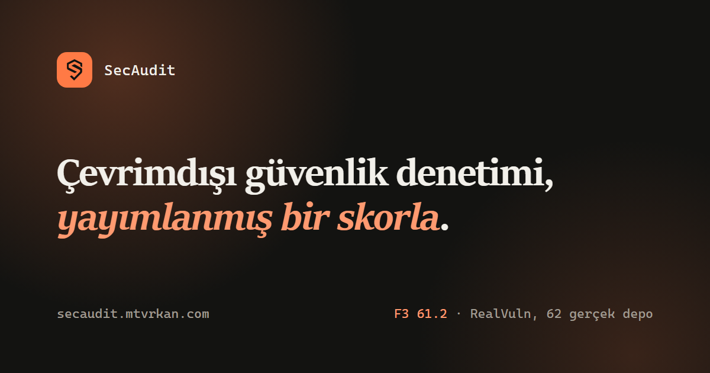

<div align="center">



# SecAudit

**Kendi tespit oranını yayımlayan — ve o ölçümü kendiniz tekrarlayabildiğiniz bir güvenlik
tarayıcısı.**

[](https://github.com/mtvrkan/secaudit/actions/workflows/validate.yml)
[](LICENSE)
[](https://docs.claude.com/en/docs/claude-code/plugins)
[](https://owasp.org/www-project-top-ten/)

[English](README.md) · [secaudit.mtvrkan.com](https://secaudit.mtvrkan.com)

</div>

---

## Tam olarak ne yapar

Bir **kod tabanına**, **çalışan bir siteye** ya da ikisine birden yöneltirsiniz. Okur, neyin
yanlış olduğuna karar verir ve üzerine iş yapabileceğiniz — ya da bir denetçiye
verebileceğiniz — bir rapor yazar.

**Bir depo verdiğinizde** kaynağı okur ve şunları raporlar:

- **Bir istekten erişilebilen enjeksiyon** — taint çekirdeği güvenilmeyen girdiyi satırlar,
  fonksiyonlar ve dosyalar boyunca izler. `db.query(sql)`, `sql` gerçekten `req.query.name`'den
  kurulduysa raporlanır; sorgu parametresi olarak bağlandığında **raporlanmaz**. Her bulgu yolu
  taşır: `L12: req.query.name (request) → L13: TAINT-JS-SQLI argüman 0`.
- **Bağımlılık uyarılarına karar, döküm değil** — her CVE, kodunuzun zafiyetli import'a gerçekten
  ulaşıp ulaşamadığına göre bir [OpenVEX](https://github.com/openvex/spec) durumuna sınıflanır ve
  kararın gerekçesi yazılır.
- **Secret'lar** — kodda ve git geçmişinde, raporda maskelenmiş olarak.
- **Yapılandırma ve altyapı** — Dockerfile, Terraform, CloudFormation, Kubernetes, Compose, bulut
  IAM, GitHub Actions.
- **Bir kalıbın göremeyeceği yapısal kusurlar** — hız sınırı olmayan bir giriş uç noktası, okuma
  ile yazma arasında hiçbir kontrol olmadan yazılan bir yükleme, alan listesi olmadan kalıcı bir
  nesneye yayılan istek gövdesi, bir satırı çağıranın verdiği id ile bulup çağıranla hiç
  sınırlamayan bir handler.

**Bir URL verdiğinizde** başlıkları, TLS'i, çerezleri, açıkta kalan yolları ve parmak izini
alabildiği teknolojiyi kontrol eder, ardından OWASP web ve API testlerini çalıştırır. Pasif
kontroller izin gerektirmez; durum değiştiren hiçbir şey, siz hedefin sahibi olduğunuzu beyan
edene kadar çalıştırılmaz.

**Geri aldığınız şey**: ciddiyete göre sıralanmış bulgular — her biri kanıtı, kök nedeni, somut
düzeltmesi ve yeniden test adımıyla — artı bağımlılık kayıt defteri, hâlihazırda doğru yaptığınız
kontroller ve 24–72 saat / 7–14 gün / 30–60 gün düzeltme sırası. İngilizce ya da Türkçe.
`--format` ayrıca GitHub code scanning için SARIF, CycloneDX SBOM, OpenVEX belgesi veya AB Siber
Dayanıklılık Yasası kanıt paketi üretir.

**Nasıl çalışır**: **sıfır bağımlılıklı** tek bir Python paketi; API anahtarı yok, hesap yok, ağ
yok. Deterministiktir — aynı kod girdi, aynı bulgular çıktı — ve CI bunu kanıtlar: tek bir
fixture'ı dört ayrı process'te farklı hash tohumlarıyla tarar, sonuçlar ayrışırsa derlemeyi
düşürür. Kendi anahtarınızı getirirseniz opsiyonel bir LLM katmanı triyaj ve mantık hatası keşfi
ekler; varsayılan kapalıdır ve **buradaki hiçbir rakam onu anlatmaz**.

> **Yalnızca savunma amaçlı.** SecAudit **sahibi olduğunuz veya test etmeye açıkça yetkili
> olduğunuz** sistemleri denetlemek içindir. Aktif test için yetkiyi beyan etmeniz gerekir.
> Silahlandırılmış exploit, zararlı yazılım, DoS yükü veya yetkisiz erişim aracı üretmez.
> Bkz. [Etik ve hukuk](#etik-ve-hukuk).

## Kurulum ve çalıştırma

```bash
# Claude Code içinde — plugin, canlı hedef izi ve yetkilendirme kapısıyla:
/plugin marketplace add mtvrkan/secaudit && /plugin install secaudit@secaudit-kit
/secaudit .

# Ya da Claude Code olmadan — aynı çekirdek; LLM yok, ağ yok, bağımlılık yok:
pip install secaudit-kit && secaudit .
```

## Neden bakmaya değer

Piyasadaki "güvenlik tarayıcıları"nın çoğu hiçbir sayı yayımlamaz, bir anahtar ister ve
checkout'unuzun sınırında durur. SecAudit'in deterministik katmanı her yerde çalışır, kendini
başkasının kıyaslamasında skorlar ve bir denetimin gerçekten ihtiyaç duyduğu parçalarla sarılıdır:
canlı bir hedef, bir rıza sınırı ve bir değerlendiriciye uzatabileceğiniz belge.

- **Bu projenin sahibi olmadığı veri kümelerinde, yayımlanmış ve yeniden üretilebilir üç
  sayı** — [RealVuln](https://github.com/kolega-ai/Real-Vuln-Benchmark) (Python) üzerinde F3
  **61.2** ve [SecBench.js](https://github.com/cristianstaicu/SecBench.js) (JavaScript) üzerinde
  recall **0.5445**. İkisi de kıyaslamaların kendi skorlayıcılarıyla ölçüldü, ham çıktı depoya
  işlendi, metin skorlayıcıyla uyuşmayı bıraktığı anda CI kırmızıya döner. JavaScript rakamı bu
  proje tek bir etiketini bile okumadan önce **0.2286 kördü**; "hiç görmediği kodda ne yapıyor"
  sorusunun cevabı odur. **Önce çekinceler, ve asıl mesele onlar.**
- **Ve kör olanı — buradaki en kötü ve en dürüst sayı.**
  [CVEfixes](https://doi.org/10.5281/zenodo.13118970) üzerinde — 3.576 gerçek CVE, her biri
  kendisini düzelten commit'e bağlanmış — SecAudit CVE bazında **24.5%**, dosya bazında **15.7%**
  buluyor. Bu veri kümesinin beşte biri **ilk tarama yapılmadan önce** mühürlendi ve bir daha
  incelenmiyor. Mühürlü dilim **17.06%**, mühürsüz
  **15.32%** — **"bu veri kümesine göre ayar yapılmadı" cümlesi iddia değil, ölçüm:** kurallar
  okunan etiketlere uydurulmuş olsaydı ilişki ters yönde çıkardı. 61.2 ile arasındaki fark bu
  sayının yayımlanma sebebi: RealVuln 62 **uygulama**, orada taint bir request'ten başlar;
  CVEfixes çoğunlukla **kütüphane**, ve kütüphanenin request'i yoktur.
  [`eval/cvefixes/`](eval/cvefixes/).
- **Ve diğerlerinin cevaplamadığı soru için bir sayı daha** — *bu araç ne kadar vaktimi
  harcayacak?* Zafiyet veri kümesi olmayan, bakımı yapılan on beş projede **1.000 satır başına
  0.42 bulgu**, bunların **0.09**'u High ya da Critical. 100 bin satırlık bir kod tabanı yaklaşık
  42 bulgu alır, 9'u aksiyon alınabilir. **Precision değil, gürültü tabanı olarak yayımlanıyor:**
  o bulguları kimse tek tek yargılamadı ve bir kısmı gerçek olabilir.
  [`eval/noisefloor/`](eval/noisefloor/).
- **Aynı taramadan AB CRA kanıt paketi** — `--format cra`; CycloneDX 1.6 SBOM, VEX durumu ve
  erişilebilirlik taşıyan zafiyet kayıt defteri, ve her bulgunun ilgili maddeye eşlenmesi
  (Ek I Bölüm I (2)(a), Bölüm II (1)/(2)/(3)). Zafiyet yönetimi yükümlülükleri **2026-09-11**'de
  başlıyor. Bulgular ayrıca bir **OWASP ASVS 5.0** bölümü taşır. Bu bir uyum sürecinin girdisidir,
  sertifika değildir — paket bunu kendi feragatnamesinde de söyler.
- **Çoğu tarayıcının durduğu yerin ötesi** — OWASP Web, API, LLM ve Mobile Top 10 ile CWE Top 25,
  artı 2025–2026 eklentileri: ajan tabanlı yapay zekâ ve MCP riskleri (tool poisoning, aşırı
  yetki), kimlik doğrulama ve kimlik (JWT/OAuth/OIDC/SAML), HTTP request smuggling, cache
  poisoning ve güncel tedarik zinciri saldırıları (kendini kopyalayan install-script solucanları,
  değişebilir etiketle CI ele geçirme, slopsquatting, provenance/SLSA).
- **Sizde varsa sizin araçlarınızı kullanır** — `semgrep`/`opengrep`, `trivy`, `osv-scanner`,
  `gitleaks`, `trufflehog`, `zizmor`, `testssl.sh`, ve aktif taramalar için yalnızca yetkiye bağlı
  `nuclei`/ZAP. **Başlamak için hiçbiri gerekmez**, ve yayımlanan rakamların hiçbiri birini
  kullanmaz.
- **Yetkilendirme sınırı bir istem değil, koddur** — aktif test, siz sahipliği beyan edene kadar
  saldırgan tarayıcıları ve durum değiştiren istekleri reddeden deterministik bir PreToolUse
  kancasının arkasındadır. DoS yok, kaba kuvvet yok, veri sızdırma asla yok.
  tarayıcıları ve durum değiştiren istekleri engeller. DoS yok, kaba kuvvet yok, veri sızdırma
  asla yok.

## Claude Code'un yerleşik güvenlik araçlarından farkı

Anthropic iki resmî güvenlik eklentisi yayımlıyor ve ikisi de iyi. **Kurun.**
[`security-guidance`](https://code.claude.com/docs/en/security-guidance) Claude kodu *yazarken*
inceler; Claude Security eklentisi bir depoyu çok ajanlı tarar ve gözden geçirilmiş yamalar
üretir. İkisi de checkout'unuzdaki kaynağı okur.

SecAudit bunu daha iyi yapmaya çalışmıyor, ve buradaki LLM katmanı ürünün içinde ücretsiz gelen
bir ajanı geçme denemesi değil. Kapsadığı şey, onların **bilerek dışarıda bıraktığı**:

| | Resmî eklentiler | SecAudit |
|---|:---:|:---:|
| Claude kodu yazarken inceleme | ✅ | — |
| Çok ajanlı depo taraması → gözden geçirilmiş yama | ✅ | — |
| Çalışan bir siteyi veya API'yi denetleme | — | ✅ |
| Aktif test için yetkilendirme kapısı + `scope.yaml` | — | ✅ |
| Claude Code olmadan, ücretli plan olmadan, çevrimdışı çalışma | — | ✅ |
| Yayımlanmış, yeniden üretilebilir tespit skoru | — | ✅ |
| Aynı kod girdi, aynı bulgular çıktı — sıfatla değil, kapıyla tutulan | — | ✅ |
| SBOM, OpenVEX ve EU CRA kanıt paketi | — | ✅ |
| Codex, Cursor, OpenCode'dan aynı çekirdek (MCP sunucusu) | — | ✅ |

Resmî belgeler bu ayrımı açıkça kuruyor: incelemenin *"çalışan bir siteyi ya da dağıtılmış bir
servisi değil, checkout'unuzdaki kaynak kodu"* okuduğunu ve taramaların nondeterministik
olduğunu — *"aynı kodun iki taraması farklı bulgular yüzeye çıkarabilir"* — kendileri yazıyor.
Hiçbiri, sahipliğini kanıtlamanız gereken bir hedefi test etmek için bir yetkilendirme sınırı
modellemiyor, ve hiçbiri bir denetçiye verilecek belge üretmiyor.

**Kendini kanıtlaması gereken satır determinizm**, çünkü gerçekleştiğini göremeyeceğiniz bir
iddia. Burada bir sıfat değil, bir kapı: CI tek bir fixture'ı dört ayrı process'te farklı
`PYTHONHASHSEED` değerleriyle tarıyor ve bulgu kümeleri ayrışırsa derlemeyi düşürüyor. O kapı,
özellik **kırıldığı için** var — taint atfı hash sırasına bağlı bir küme üzerinde dolaşıyordu,
aynı çekirdek aynı hatayı koşuya göre 739. ya da 743. satırda raporluyordu ve bir kıyaslama
etiketi bununla birlikte skorlama penceresine girip çıkıyordu. Kod yerinde dururken yayımlanmış
bir sayının kendi kendine oynamasıyla yakalandı; düzeltme ve testi birlikte geldi, hikâyesi
[`CHANGELOG.md`](CHANGELOG.md) içinde.

İkisini birlikte çalıştırın: oturum içi eklenti dalınıza ulaşanı azaltır, SecAudit sonrasında
size sorulan soruyu cevaplar.

## Kurulum

Claude Code gerekir. Bir Claude Code oturumunda:

```bash
/plugin marketplace add mtvrkan/secaudit
/plugin install secaudit@secaudit-kit
```

Hepsi bu. Başlamak için kurulacak araç yok — SecAudit yalnızca Claude ile çalışır. Daha derin
taramalar için isteğe bağlı olarak önerilen araçları kurun (`semgrep`, `osv-scanner`, `gitleaks`,
`testssl.sh`).

## Kullanım

```bash
/secaudit https://siteniz.com          # canlı hedefin tam denetimi (varsayılan pasif)
/secaudit ./depo/yolu                  # statik kaynak + bağımlılık + secret denetimi
/secaudit https://site.com ./depo      # ikisi birden — kod canlı bulguyu doğrular, tersi de

/secaudit-code                         # yalnızca mevcut dizinin kaynak denetimi
/secaudit-passive https://site.com     # yalnızca keşif, hiçbir yetki gerekmez
/secaudit-deps                         # yalnızca bağımlılık + tedarik zinciri + secret

/secaudit https://site.com --active    # yetkili aktif test (sahipliği siz beyan edersiniz)
/secaudit ./depo --lang tr             # rapor Türkçe
```

Canlı bir hedefe karşı aktif test için `templates/scope.example.yaml` dosyasını doldurun ya da
yetkiyi sohbette beyan edin. Bkz. [Yetkilendirme](docs/authorization.md).

## Claude Code olmadan çalıştırma

`kit/` dizini, bir Claude Code oturumu dışında — CI'da, cron'da ya da düz bir kabukta — çalışan,
bağımlılığı olmayan bir Python CLI'ıdır ve Claude'a bağlı değildir:

```bash
python -m secaudit_core.cli /depo/yolu --min high        # Tier 0: deterministik, LLM yok, anahtar yok
python -m secaudit_core.cli /depo/yolu --format cra      # EU CRA kanıt paketi (SBOM + defter + VEX)
python -m secaudit_core.cli /depo/yolu --format cyclonedx # yalnızca CycloneDX 1.6 SBOM
python -m secaudit_core.cli /depo/yolu --format html     # kendi kendine yeten rapor; PDF'e yazdırın
python -m secaudit_core.cli /depo/yolu --backend ollama  # opsiyonel yerel model zenginleştirmesi
```

Tier 0 (yerleşik dedektör paketi + taint analizi + `npm audit`) her zaman çalışır, anahtar
istemez ve yeniden üretilebilir — buradaki her sayının anlattığı katman odur. Tier 1, takılabilir
bir arka uç arkasındaki opsiyonel LLM triyajı ve mantık hatası keşfidir (`anthropic` / `openai` /
`ollama` / `none`); ölçülmemiştir, kaynak kod gönderir ve açmadan önce aşağıda tam olarak
anlatılır.

## Ölçülen sayılar

| | Ne ölçtüğü | Sonuç |
|---|---|---|
| **Kendi veri kümesi** | Regresyon tabanı — fixture'lar dedektörlerle birlikte yazıldı | Recall **%98** (61/62), 15 dil, F3 **0.986** |
| **RealVuln** (dış, Tier 0, Python) | 66 reponun 62'si, kıyaslamanın kendi skorlayıcısı | F3 **61.2**, precision **0.6560**, recall **0.6073** |
| **SecBench.js** (dış, Tier 0, JavaScript) | 575 gerçek npm paketinde 573 etiketli sink | recall **0.5445** (312 bulundu) · kör koşu **0.2286** |
| **CVEfixes** (dış, Tier 0, kör) | 3.576 gerçek CVE, düzeltme commit'lerinden satır etiketi | CVE bazında **24.5%** · dosya bazında **15.7%** |
| **Gürültü tabanı** | Zafiyet veri kümesi *olmayan* 15 bakımlı proje | 1.000 satırda **0.42** bulgu · **0.09**'u High/Critical |

```bash
python3 eval/harness.py        # kendi veri kümesini yeniden üretin
```

Kendi veri kümesindeki tek kaçak IDOR / bozuk erişim denetimidir; güvenilir bir statik imzası
yoktur ve LLM katmanına ait olarak belgelenmiştir. **Bu bir regresyon tabanıdır, bir öngörü
değil:** o fixture'lar dedektörlerle birlikte yazıldı, dolayısıyla sayı "bu hâlâ çalışıyor" der,
"sizin kodunuzda da çalışacak" demez.

### Dış sayı: Python'da F3 61.2

[RealVuln](https://github.com/kolega-ai/Real-Vuln-Benchmark) üzerinde ölçüldü — bu kodu hiç
görmemiş insanlar tarafından etiketlenmiş 66 gerçek zafiyetli depo, bizim değil **onların**
skorlayıcısıyla.

| | F3 | Precision | Recall |
|---|---|---|---|
| Amaca özel (Kolega.Dev) | 73.0 | 0.388 | 0.809 |
| Genel amaçlı LLM (Claude Sonnet 4.6) | 51.7 | 0.785 | 0.498 |
| Kural tabanlı SAST (Semgrep) | 17.7 | 0.205 | 0.175 |
| **SecAudit Tier 0** | **61.2** | **0.6560** | **0.6073** |

**Sayıdan önce çekinceyi okuyun.** İlk iki koşu 12.5 ve 13.3'tü ve **kördü** — çekirdek bu veri
kümesini hiç görmemişti. Sonrakiler değil: eklenen kurallar bu kıyaslamanın kendi false
negative'leri okunarak seçildi. Her biri herhangi bir SAST'ın gönderdiği ders kitabı kuralıdır
(token için zayıf PRNG, çerez bayrakları, CSRF muafiyetleri, commit'lenmiş yedek imzalama
anahtarı, varsayılan açık debug, açık yönlendirme, NoSQL enjeksiyonu, log'a düşen kimlik
bilgileri), yani hiçbiri bir fixture'a uydurulmuş kalıp değil — ama **seçim** veri kümesine
bakılarak yapıldı. 12.5 bu çekirdeğin okumadığı bir veri kümesinde yaptığıdır; 61.2 defalarca
okuduğu birinde yaptığı. **Aradaki fark, avantajın büyüklüğüdür.**

**Precision bir yan ürün değil, kısıttır.** Yedi tur boyunca recall ile birlikte yükseldi ve
sekizincide düştü; düştüğü tur, gerekçesi yumuşatılmak yerine yazılarak tutuldu. Recall satın
almak için precision harcaması gereken bir tur öyle kaydedilir, ve iki genişletme
**ölçülüp reddedildi** çünkü getirdiğinden fazlasına mal oluyordu. Her turun ne kazandırdığı, neye
mal olduğu ve yayımlanmış bir rakamın artık var olmayan bir çekirdeği anlattığının iki kez ortaya
çıkışı [`eval/realvuln/`](eval/realvuln) ve `CHANGELOG.md` içinde.

Hâlâ kımıldamayan: `broken_access_control` (2/76) ve `missing_auth` (7/74) — iki ailedeki 150
etiketin 141'i, yani bu veri kümesindeki tüm kaçakların beşte biri, ve bir uygulama sahibinin ilk
sorduğu sınıf. `path_traversal` bir zamanlar bu listede 3/39 ile duruyordu, şimdi **23/39** — bir
ailenin teşhisi "eksik yetenek" değil "eksik şekil" olduğunda böyle görünür. Kalan en büyük iki
havuzun — `sensitive_data_exposure` ve `security_misconfiguration` — kaçakları okununca sebep
görünüyor: o etiketlerin çoğu bir handler tanımının üzerinde duruyor, yani kusur handler'ın
içindeki herhangi bir şeyin değil, **döndürdüğü her şeyin** özelliği. Bunun için başka bir kural
değil, iş mantığı geçişi gerekir.

### Diğer dil

RealVuln yalnızca Python. JavaScript ve TypeScript tarafı —kalıp kuralları, beş yapısal analiz ve
bir taint katmanı— ayrıca [SecBench.js](https://github.com/cristianstaicu/SecBench.js) üzerinde
ölçülüyor: **573 etiketli sinkin 312'si, recall 0.5445**, 575 gerçek npm paketinde. Bu, bir
önceki koşunun çekebildiğinden on dokuz paket daha az — o paketler npm'den kaldırıldı,
etiketleri kaçak sayılıyor ve iki rakam aynı ölçüm değil. Karşılaştırılabilir yarı çekirdeğin
kendisi: *"sink'te hiçbir kural çalışmadı"* kaçakları 213 → 201.

**O kıyaslamanın ilk koşusu kördü — recall 0.2286 — bu koşu değil.** Kör rakam, bu proje tek bir
SecBench.js etiketini okumadan önce ölçüldü; *hiç görmediği kodda ne yapıyor* sorusunun dürüst
cevabı odur ve iyileşmez. Kör koşunun getirdiği şey bir teşhis oldu.

| Sınıf | Bulunan / etiketli | Recall | Kör koşu |
|---|---|---|---|
| `code-injection` | 22 / 33 | **66.7%** | 19 / 33 |
| `command-injection` | 62 / 101 | **61.4%** | 41 / 101 |
| `path-traversal` | 128 / 167 | **76.6%** | 61 / 167 |
| `prototype-pollution` | 72 / 185 | **38.9%** | 10 / 185 |
| `redos` | 28 / 87 | **32.2%** | 0 / 87 |

**Orada kımıldayan her sınıf tek bir sebeple kımıldadı: çekirdek baktığı yapıyı göremiyordu.**
Varsayılan bir parametre değeri, her yapısal kuralı kapsamlandıran analiz için fonksiyonu tek
satırlık gösteriyordu; `exec` dosyanın ne import ettiğine göre değişen bir şeydi; ReDoS kriterleri
*üstel* geri izlemeyi tarif ediyordu, oysa yayımlanmış raporların çoğu **karesel**. Hiçbiri bir
eşik değildi; her biri bir şekildi — mühürlü dilimin geri kalanla birlikte kımıldamasının sebebi
de bu. Etiket etiket dökümü: [`eval/secbenchjs/`](eval/secbenchjs).

**O veri kümesinin beşte biri mühürlü** ([`eval/HELDOUT.md`](eval/HELDOUT.md)) — her turda
skorlanır, asla incelenmez. Böylece yalnızca okuduğu etiketlere uyan bir tur, mühürsüz kısım
kımıldarken mühürlü kısım dururken görünür hâle gelir. İki tur bunu sordu ve ikisinde de iyileşme
genelleşti: mühürlü **0.4215 → 0.4545 → 0.5455 → 0.5868**, mühürsüz
**0.3739 → 0.4027 → 0.4735 → 0.5288** — kimsenin okumadığı yarı, dördün ikisinde daha çok
ilerledi.

**O veri kümesi için precision bilinçli olarak yayımlanmıyor.** SecBench.js paket başına tek bir
zafiyet etiketler ve paketin geri kalanı hakkında hiçbir şey söylemez; dolayısıyla eşleşmeyen
bulgu oranı bir precision değil, gürültü için bir alt sınırdır, ve 0.6560'ın yanına konması adı
aynı olan iki ayrı ölçümü karşılaştırmak olurdu.

### LLM katmanı: opsiyonel, ölçülmemiş, ve öyle kalacak

**Yukarıdaki her rakam Tier 0'dır.** LLM katmanı varsayılan olarak kapalı, sizin sağladığınız bir
anahtar istiyor ve **ölçülmüş bir sayısı yok** — "henüz yok" değil, kalıcı bir karar olarak:
ölçmek 62 repo boyunca ücretli çıkarım demek ve bu proje o masrafı üstlenmiyor. Ölçüm koşum takımı
yine de kutuda geliyor ([`eval/realvuln/`](eval/realvuln), tek komut); rakamı üreten olursa bir
issue açsın, sayfaya adıyla birlikte girer.

Bu, iddianın bilinçli olarak daraltılmasıdır; o yüzden dar okuyun. Aynı kıyaslamada hiçbir koşum
takımı olmayan genel amaçlı bir model **51.7** alıyor — deterministik katman artık 61.2 ile onun
üstünde, ama model **kör** ölçüldü ve bu çekirdek veri kümesini defalarca okudu, dolayısıyla
karşılaştırma göründüğü kadar bir zafer değil. Dürüst iddia "daha çok buluyoruz" değil;
**tekrarlanabilir şekilde, çevrimdışı, rıza sınırı olan ve bir denetçinin okuyabileceği bir
çıktıyla buluyoruz — ve sayıyı yayımlıyoruz.** Kimse bu kiti LLM katmanı için kurmasın.

Katmanı açtığınızda ne yapar: Tier 0 bulgularının triyajı ve karşıt görüşle çürütülmesi, artı
handler başına bir olgu haritası üzerinde, yukarıda kımıldamayan sınıfları hedefleyen bir iş
mantığı geçişi. Hiçbir Tier 0 bulgusu üretmez, yani açmak buradaki hiçbir rakamı değiştiremez.

**Bir tarih kaydı duruyor, çünkü iddia bir ay boyunca kamuya açıktı.** 2026-08-13'e kadar
katmanın istemi yalnızca Tier 0'ın kendi bulgularını taşıyordu, hiç kaynak taşımıyordu; yani
triyaj kodu değil bir atfı yargılıyordu. [`llmcontext.py`](kit/secaudit_core/llmcontext.py) ile
düzeltildi — bu, katmanı *yapamaz* durumundan *test edilmemiş* durumuna taşıdı, ki kulağa
geldiğinden daha küçük bir iddiadır.

> **Katmanı açmak kaynak kodunuzu gönderir.** Her Tier 0 bulgusunun çevresindeki alıntılar *ve*
> Tier 0'ın hiç işaretlemediği tam dosyalar — ikinci kısım, bir modelin kalıp katmanının yapısal
> olarak ulaşamadığı sınıflara ulaşmasının tek yolu. Bu yüzden `--backend ollama` (yerel, hiçbir
> şey makineden çıkmaz) bir maliyet kararı değil, **gizlilik** kararıdır. Kimlik bilgisi şekilli
> dosyalar (`.env`, `*.pem`, `*.key`, `secrets/`, …) hiçbir arka uca gönderilmez. Tarama başına
> dört model çağrısı; bir depo sığmadığında rapor kaç dosyanın gönderilmediğini yazar — kısmi bir
> görüntü üzerinden yapılan triyaj asla temiz kâğıt olarak basılmaz.

## Ne alıyorsunuz

Yapılandırılmış bir rapor: yönetici özeti → kapsam ve kısıtlar → metodoloji → ciddiyete göre
sıralanmış bulgular (her biri etki, kanıt, kök neden, **somut düzeltme** ve **yeniden test adımı**
ile) → bağımlılık/CVE kayıt defteri → hâlihazırda sahip olduğunuz olumlu kontroller → önceliklendirilmiş
düzeltme yol haritası. [Örnek rapor](examples/example-report.md).

> **Kendi üzerinde test edilmiş — recall *ve* precision.** Eşli iki fixture. **Zafiyetli**
> olanı 15 dilde **62 kod kusuru** artı 10 bağımlılık zafiyeti ve secret'lar ekiyor; depoya
> işlenmiş [öz test raporu](examples/self-test-report.md) hiçbir tarayıcı kurulu değilken
> yakalanmış bir koşudur ve hepsini yüzeye çıkarır — **recall**. **Güvenli** fixture
> ([`secure-app`](tests/fixtures/secure-app)) *aynı* özellikleri güvenli biçimde uygular: 62 tuzak,
> her biri zafiyetli ikizinin doğru uygulaması, ve doğru bir denetim onların üzerinde sessiz kalır
> — **precision**, yani boşuna alarm yok. CI ikisini birden tutar, böylece bir sink birinden
> sessizce kaybolamaz ya da diğerinde yeniden belirmez.

## Nasıl çalışır

```
Hedef ──▶ Tür tespiti (URL / kaynak / ikisi) ve mevcut araçlar
      ──▶ Yetkilendirme kapısı  (pasif = serbest · aktif = sahiplik beyanı şart)
      ──▶ Fazlı metodoloji:
            P1 Pasif keşif        P4 OWASP web testleri  P7 Altyapı / bulut / IaC
            P2 Saldırı yüzeyi     P5 API testleri        P8 Mobil (uygulamaysa)
            P3 Bilinen CVE/bağ.   P6 Kaynak incelemesi   P9 AI/LLM güvenliği (AI ise)
      ──▶ Her bulgunun doğrulanması (high/critical için karşıt görüşle çürütme)
      ──▶ Önceliklendirme (CISA KEV → maruziyet → etki)
      ──▶ Rapor (EN/TR): düzeltmeler + yeniden test kontrol listesi
```

Tam metodoloji: [docs/methodology.md](docs/methodology.md).

## Özellikler

| | |
|---|---|
| **Canlı URL denetimi** | başlıklar, TLS, çerezler, maruziyet, teknoloji parmak izi, OWASP web/API testleri |
| **Kaynak denetimi (SAST)** | kaynak→sink taint yolları (Python AST + JS/TS tarayıcı), yetkilendirme boşlukları, enjeksiyon, SSTI, deserialization, secret'lar, zayıf kripto |
| **Kimlik doğrulama ve kimlik** | JWT (alg karışıklığı, `alg:none`), OAuth/OIDC (`redirect_uri`, PKCE, `state`), SAML (XSW), oturumlar, MFA, passkey |
| **Modern web** | HTTP request smuggling/desync, cache poisoning/deception, prototype pollution, DOM clobbering, CSWSH, CSPT |
| **Bağımlılık / tedarik zinciri** | çok ekosistemli CVE'ler, **OpenVEX erişilebilirlik kararlarıyla**; slopsquatting, install-script solucanları, değişebilir etiketle CI ele geçirme, provenance/SLSA, KEV çapraz kontrolü |
| **Secret tespiti** | kod + git geçmişi; maskeli raporlama, rotasyon rehberi |
| **Altyapı / IaC / CI-CD** | Dockerfile, Terraform, CloudFormation, K8s, Compose, bulut IAM, GitHub Actions (`zizmor`, SHA sabitleme) |
| **AI / LLM / ajanlar** | prompt injection (doğrudan + dolaylı/RAG/çok kipli), çıktı → XSS, aşırı yetki, MCP tool poisoning, ajan tehditleri, maliyet sınırları |
| **Mobil** | Android / iOS / Flutter — MASVS / Mobile Top 10 |

## Yetkilendirme — pazarlık konusu değil

Canlı bir hedefe karşı **aktif** test, deterministik bir PreToolUse kancasının arkasındadır.
Temiz yol, hedef depoda bir `scope.yaml` oluşturmaktır: sahip, onay, kapsamdaki alan adları, test
hesapları, hariç tutulan yollar, hız sınırları. Dosya **izlenmemiş** bırakılır — kanca
commit'lenmiş bir `scope.yaml`'ı reddeder, çünkü bir clone ile gelen dosya bu operatörün yaptığı
bir beyan değildir.

Pasif kontroller (kaynak kod okuma, bağımlılık/SBOM/secret/SAST taraması, normal bir tarayıcının
yapacağı `GET` istekleri) yetki gerektirmez.

## Codex, Cursor, OpenCode ya da herhangi bir MCP istemcisinden

Claude Code SecAudit'i eklenti olarak alır. Diğer her şey aynı çekirdeğe MCP üzerinden ulaşır:

```bash
python3 -m secaudit_mcp --tools        # sunucuyu doğrula, araç manifestini yazdır
claude mcp add secaudit -- python3 -m secaudit_mcp
```

Altı araç: `scan_source`, `scan_dependencies`, `generate_sbom`, `compliance_pack`,
`explain_finding` — ve `coverage`, ki bir belge sayfası değil bilerek bir **araç**. Bulguları alan
ama sınırları soramayan bir MCP istemcisi, boş bir sonucu "güvenlik sorunu bulunamadı" diye
özetler; bu, çekirdeğin hiç yapmadığı bir iddiadır. Canlı hedef taraması bilerek **açılmadı**:
çalışan bir sistemi yoklamaya rıza insan kararıdır, ve test paketi hiçbir araç şemasının `url`,
`host` ya da `endpoint` kabul etmediğini doğrular. İstemci başına yapılandırma:
[docs/mcp.md](docs/mcp.md).

## Etik ve hukuk

SecAudit bir **savunma** aracıdır. Kullanarak, yalnızca sahibi olduğunuz veya test etmeye açıkça
yetkili olduğunuz varlıkları test etmeyi kabul edersiniz. Sistemlerin yetkisiz taranması veya test
edilmesi çoğu yargı bölgesinde suçtur. Geliştiriciler kötüye kullanımdan sorumlu değildir. Tam
metin: [DISCLAIMER](DISCLAIMER.md) ve [SECURITY.md](.github/SECURITY.md).

Şunları yapmayı reddeder: DoS/kaba kuvvet çalıştırmak, gerçek veri/PII sızdırmak, asgari kanıtın
ötesine geçen sömürü, ya da silahlandırılmış exploit kodu, zararlı yazılım veya tespit atlatma
aracı üretmek.

## Neyi kaçırdığı

[`docs/what-we-miss.md`](docs/what-we-miss.md) — çekirdeğin kendisinden üretilir, elle yazılmaz.
Temiz bir raporu her şeyin yolunda olduğunun kanıtı saymadan önce okuyun. Elle bakımı yapılan bir
sınırlılık sayfası bir sürüm boyunca doğrudur, sonra sessizce eksik beyana dönüşür — ki bu, bu
belgenin en kötü yönde bozulma biçimidir.

## Belgeler

- [secaudit.mtvrkan.com](https://secaudit.mtvrkan.com) — açılış sayfası (EN / TR)
- **[Neyi kaçırdığı](docs/what-we-miss.md)** — false negative'ler, çekirdeğin kendisinden üretilir
- **[Dil kapsamı](docs/language-coverage.md)** — dil başına analiz derinliği, elle yazılmaz;
  dağıtım tablolarından türetilir
- **[CI'da çalıştırma](docs/ci.md)** — GitHub Action, pip, Docker ve pre-commit; çıkış kodları ve
  yeşil bir derlemenin ne anlama gelip gelmediği
- **[Diff kipi](docs/diff-mode.md)** — `--since <ref>`: bir pull request'i devraldığı borca göre
  değil, getirdiğine göre değerlendirin
- **[Sürekli izleme](docs/continuous-mode.md)** — `--watch`: CRA'nın 24 saatlik saati pratikte
- **[Uyum eşlemesi](docs/compliance.md)** — ASVS, CRA ve PCI DSS eşlemelerinin ne iddia ettiği, ve
  gerekçesiyle birlikte adı konarak reddedilen iki standart
- **[Kurulumu doğrulama](docs/supply-chain.md)** — her sürümde derleme kanıtı ve SBOM
  attestation'ı, ve bunları bize güvenmeden nasıl kontrol edeceğiniz
- [Başlangıç](docs/getting-started.md) · [Yetkilendirme ve kapsam](docs/authorization.md)
- [Canlı URL kipi](docs/live-url-mode.md) · [Kaynak kod kipi](docs/source-code-mode.md) ·
  [MCP sunucusu](docs/mcp.md)
- [Araç kurulumu](docs/tooling-setup.md) · [Metodoloji](docs/methodology.md) · [SSS](docs/faq.md)
- **[Tehdit modeli](docs/threat-model.md)** — hangi sınırı ne geçiyor, ve her kontrolün
  **engellemediği** ne. Taranan depo güvenilmeyen bir yazardır; düşmanca bir şeye doğrultmadan
  önce okunmaya değer.

Belgelerin çoğu İngilizcedir; rapor çıktısı `--lang tr` ile Türkçedir.

## Katkı

Yeni kontroller, araç entegrasyonları, dil kapsamı ve false positive düzeltmeleri memnuniyetle
karşılanır. Bkz. [CONTRIBUTING.md](CONTRIBUTING.md) ve [Davranış Kuralları](CODE_OF_CONDUCT.md).

## Lisans

[MIT](LICENSE) © mtvrkan — ayrıntı: [LICENSING.md](LICENSING.md).

<div align="center">
<sub><a href="https://docs.claude.com/en/docs/claude-code">Claude Code</a> için yapıldı. Anthropic veya OWASP ile bağlantılı değildir. SecAudit ürününüzü güvene aldıysa bir yıldız memnun eder.</sub>
</div>
